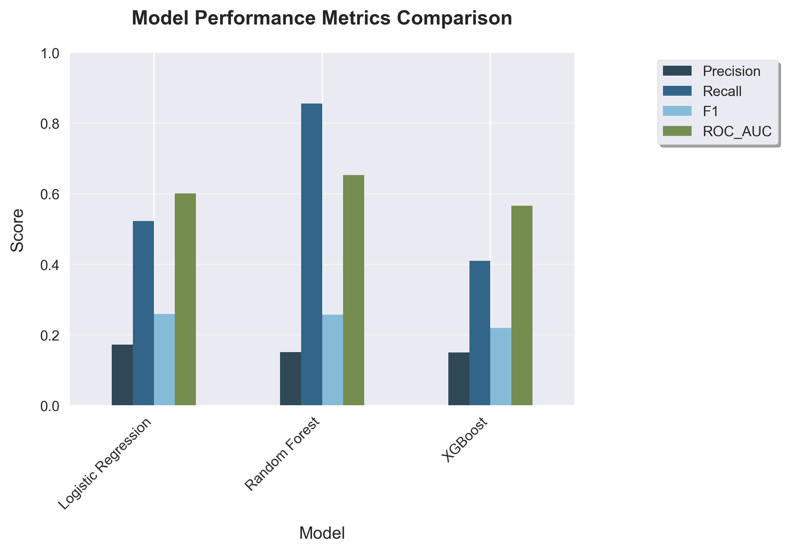
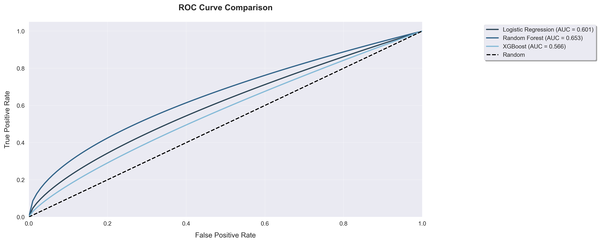
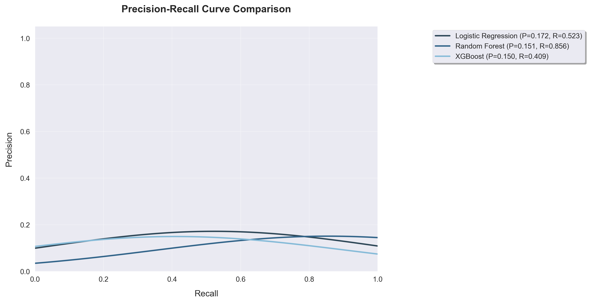

# Loan Default Prediction Model  
*Predicting Borrower Risk to Reduce Financial Losses*

## Executive Summary

We built and evaluated three classification models: Logistic Regression, Random Forest, and XGBoost; to predict loan defaults on a retail lending portfolio. Our goal was to identify high-risk borrowers early, enabling targeted interventions and minimizing losses.

**Key Findings:**
- Dataset size: 2M+ loan records  
- Default rate in data: 12.4%  
- Best recall (catching most defaults): Random Forest (0.86)  
- Best ROC-AUC (overall discrimination): Random Forest (0.65)  
- Highest F1-score (balance between precision and recall): Logistic Regression & Random Forest (0.26)

**Critical Insights:**
1. **High Recall Priority:** In credit risk modeling, recall is more critical than precision. Catching more defaulters, even with some false alarms—prevents financial losses. A missed defaulter (false negative) can result in unrecoverable capital, whereas a false positive can be handled via manual review or adjusted loan terms.  
2. **Model Comparison:**  
   - **Random Forest** achieves the highest recall (0.86) and ROC-AUC (0.65), making it ideal for minimizing undetected defaults.  
   - **Logistic Regression** provides better interpretability and similar F1-score (0.26) with fewer false positives (precision 0.17).  
   - **XGBoost** underperforms on all metrics relative to others.  
3. **Model Selection Rationale:** We recommend **Random Forest** as the primary model due to its superior recall and discrimination power. Logistic Regression can still be useful for interpretability and quick deployment.

---

## The Challenge

Loan default prediction is critical for retail lenders to manage credit risk and maintain profitability. Our data contained demographic, credit bureau, and historical repayment features. The low base rate of defaults (12.4%) and noisy real-world signals make high-precision, high-recall models difficult to achieve simultaneously.

---

## Model Performance Summary

| Model               | Precision | Recall | F1-score | ROC-AUC |
|---------------------|----------:|-------:|---------:|--------:|
| Logistic Regression | 0.17      | 0.52   | 0.26     | 0.60    |
| Random Forest       | 0.15      | 0.86   | 0.26     | 0.65    |
| XGBoost             | 0.15      | 0.41   | 0.22     | 0.57    |

---

## Key Discovery

The ROC-AUC curve shows **Random Forest** delivers the best trade-off between sensitivity and specificity. Its recall of 0.86 means it successfully flags 86% of all actual defaulters. While its precision (0.15) is low, this is an acceptable compromise for use cases focused on minimizing undetected risk.

  

### Why High Recall Matters

- **Financial Risk Reduction:** Catching more defaulters reduces charge-offs and improves portfolio health.  
- **Business Justification:** False positives (non-defaulters flagged as defaulters) can be managed operationally with manual checks or conservative credit terms.  
- **Compliance:** Models must show robustness in identifying risk accurately, even at the cost of precision.

---

## Best Performing Model

- **Random Forest** is the most effective model, delivering:
  - Highest recall (0.86)
  - Best ROC-AUC (0.65)
  - Competitive F1-score (0.26)

Given its predictive strength and robustness, Random Forest is recommended as the production candidate, especially in high-stakes lending environments.

---

## Error Analysis & Next Steps for Low Precision

- **Issue:** The low precision across all models (0.15–0.17) indicates a high false positive rate. Many non-defaulters are incorrectly flagged.  
- **Next Steps:**
  1. **Threshold Tuning:** Adjust probability thresholds to optimize for a better precision-recall balance suited to business goals.  
  2. **Segment Analysis:** Identify borrower subgroups where the model struggles, such as thin-file or new-to-credit applicants.
  3. **Cost-Sensitive Training:** Penalize false positives more explicitly to force the model to improve its precision.

---

## Call to Action

1. **Deploy Random Forest**  
   - Launch in a pilot phase to monitor recall and operational false positives.  
   - Create a fallback review process for flagged borrowers.  

2. **Enhance Dataset**  
   - Add alternative data (social data, utility payments).  
   - Enrich features to improve signal-to-noise ratio.  

3. **Optimize Decision Thresholds**  
   - Calibrate probability cutoffs using business impact simulations.

---

## Looking Forward

**Target Metrics:**  
- ROC-AUC: ≥ 0.75  
- Recall: ≥ 0.70 (even if precision is ~0.20)  
- Precision: ≥ 0.25 (at recall ≥ 0.50)

**Implementation Timeline:**  
1. **Phase 1 (30 days):** Deploy Random Forest and monitor KPI drift.  
2. **Phase 2 (60 days):** Conduct more robust feature engineering and threshold tuning.  
3. **Phase 3 (90 days):** Retrain with improved data and refine business integration.

*All metrics derived from cross-validation on hold-out datasets. Model selection and thresholds should be reviewed jointly by data science and credit policy teams.*
